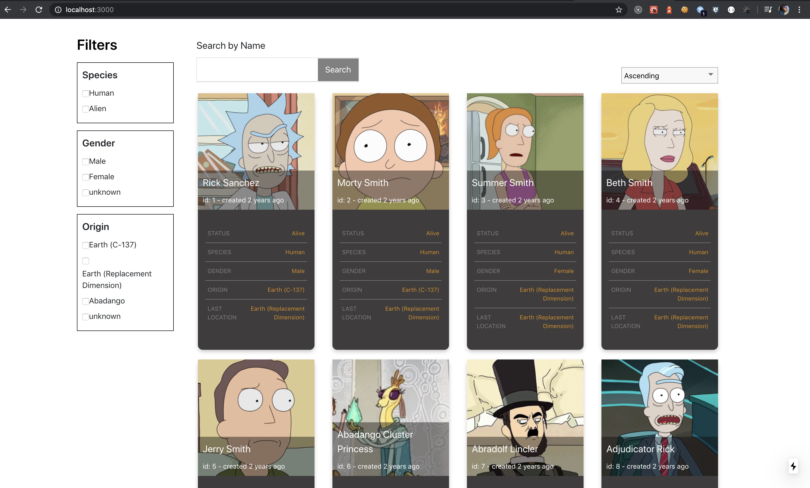
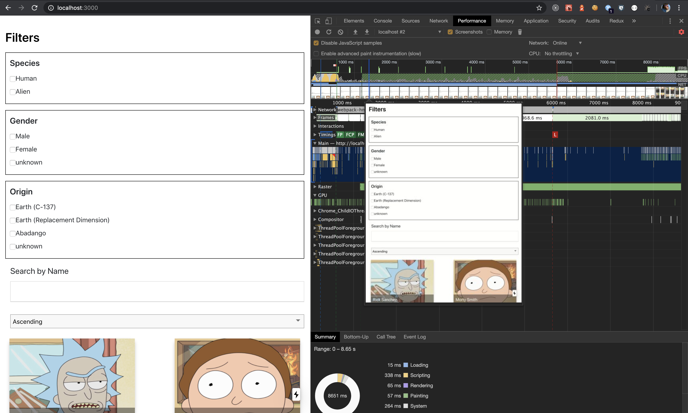

# rickandmorty

#To run the only client side of the project - yarn run start / npm run start

#To run the project with both client side and SSR - yarn run dev / npm run dev

#To run eslint - yarn run lint / npm run lint

#To run both SSR and eslint for the project - yarn run dev:app / npm run dev:app

#Client Side Rendering Desktop

#Server Side Rendering Desktop

#Client Side Rendering Mobile

#Server Side Rendering Mobile

